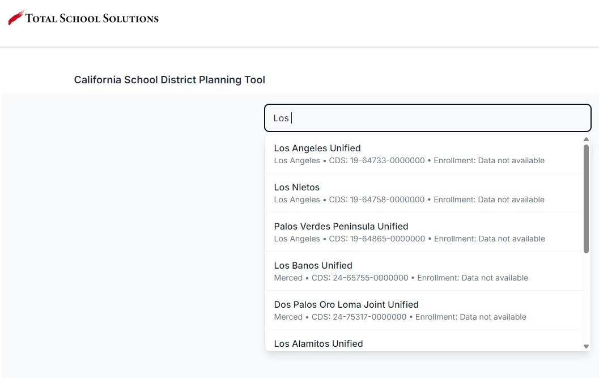
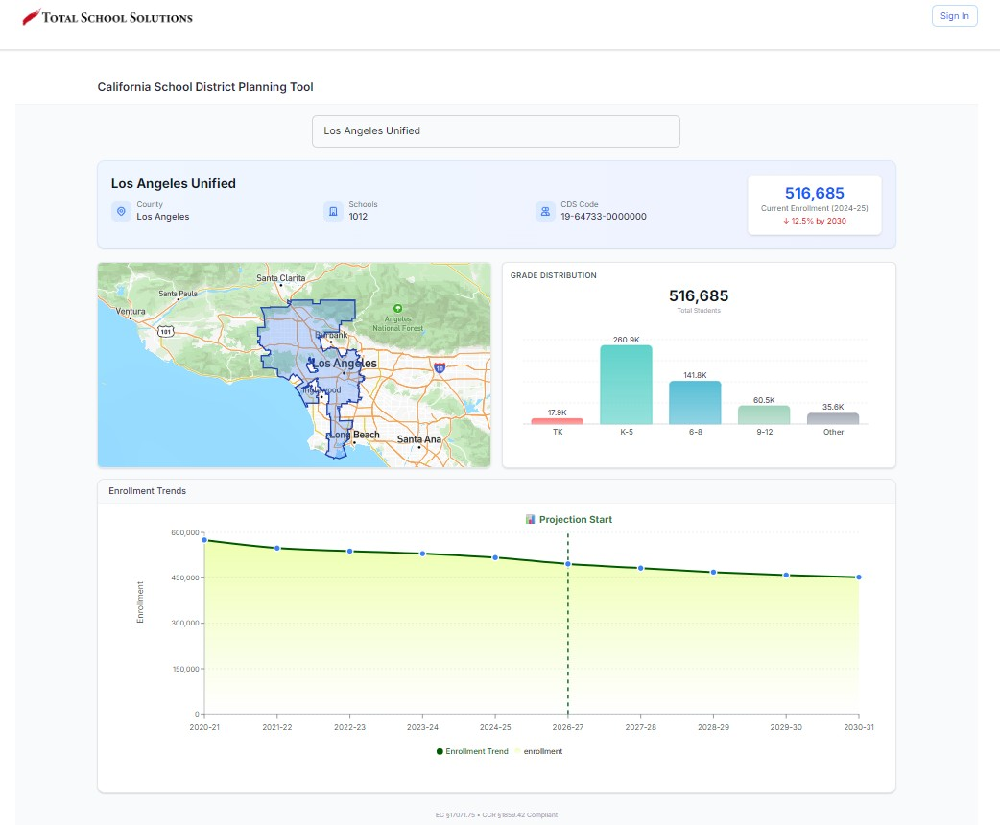
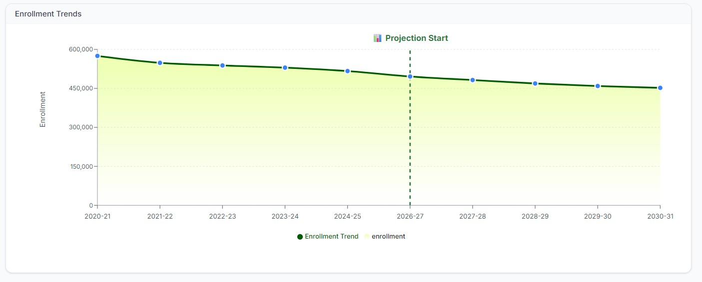
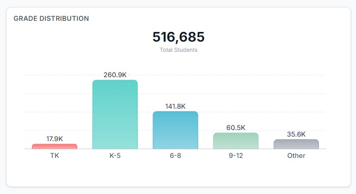

# Ashique Mahmud — PhD Portfolio

> Economics graduate (MSS) | Data Analyst | Demographic Forecasting | GIS & Spatial Analysis

---

## 📌 Table of Contents

1. [About Me](#about-me)
2. [Featured Project](#-featured-project-enrollment-projection--boundary-mapping-web-app)
3. [Screenshots](#-screenshots)
4. [Methodology](#-methodology)
5. [Technical Stack](#-technical-stack)
6. [Professional Work](#-professional-work-private-repositories)
7. [Publications](#-publications)
8. [Technical Skills](#-technical-skills)
9. [Contact](#-contact)

---

## About Me

I am an Economics graduate (MSS) currently working as a Data Analyst for a California-based educational consultancy. I produce demographic and enrollment projection reports for K-12 school districts using **cohort survival modeling**. My work provides the analytical foundation for district funding decisions, boundary policies, and developer fee justifications.

---

## 🚀 Featured Project: Enrollment Projection & Boundary Mapping Web App

| | |
|---|---|
| **Live Demo** | [Insert link if deployed] |
| **Source Code** | [Insert link to your Enrollment Projection App repository] |
| **Status** | Active Development / Production |

### What It Does

| Feature | Description |
|---------|-------------|
| 🔍 **District Search** | User enters any California school district name |
| 📈 **Enrollment Projection** | Displays 5-year historical + 5-year projected enrollment (line chart) |
| 📊 **Grade-Level Breakdown** | Current enrollment by grade level (TK, K-6, 7-8, 9-12, others) — column chart |
| 🗺️ **Boundary Mapping** | Renders district boundary on OpenStreetMap base map |

---

## 📸 Screenshots

### 1. District Selection

### 2. Full Application Interface (Los Angeles Unified)

### 3. District Profile

### 4. Enrollment Forecast Chart

### 5. Grade-Level Breakdown

### 6. District Boundary Map

---

## 🧠 Methodology

| Component | Method |
|-----------|--------|
| **Forecasting** | Cohort survival modeling, ARIMA, Prophet, LSTM |
| **Spatial Analysis** | GIS boundary rendering on OpenStreetMap (Leaflet, Folium) |
| **Visualization** | Interactive charts (Chart.js / D3) |
| **Data Sources** | California school district enrollment and boundary data |

---

## 🛠️ Technical Stack

| Category | Technologies |
|----------|--------------|
| **Backend** | Python (Flask / FastAPI) |
| **Frontend** | TypeScript, JavaScript, Next.js |
| **Mapping & GIS** | QGIS, GeoPandas, Shapely, Folium, Leaflet, OpenStreetMap |
| **Charts & Visualization** | Chart.js, D3, Matplotlib |
| **Databases** | PostgreSQL (PostGIS), MySQL, Firebase |
| **Forecasting** | scikit-learn, statsmodels, Prophet, TensorFlow (LSTM) |

---

## 💼 Professional Work (Private Repositories)

*Due to client confidentiality, the following are in private repositories:*

| Project Type | Description |
|--------------|-------------|
| **Demographic & Enrollment Projection Reports** | Cohort survival modeling for K-12 school districts |
| **School Facility Needs Assessment (SFNA)** | Analysis of residential and commercial development impact fees |
| **Level 1 Developer Fee Justification Studies** | School district funding analysis |
| **Facility Master Planning & Boundary Analysis** | Using QGIS and Python spatial libraries |

---

## 📄 Publications

**Mahmud, A.** , Osmani, M. A. G., Sharmin, S., Sarker, S., & Shampa, N. D. (2023).  
*Understanding the Environmental Kuznets Curve Hypothesis: Empirical Evidence from Bangladesh.*  
Research & Development, 4(2), 44-52.  
https://doi.org/10.11648/j.rd.20230402.12

**Methods used**: ARDL bound tests, Error Correction Model (ECM), short-run causality analysis, OLS estimations, pre-diagnostic and post-diagnostic tests.

---

## 🔧 Technical Skills

| Category | Skills |
|----------|--------|
| **Programming** | Python, R, TypeScript, SQL, Excel VBA |
| **GIS & Spatial** | QGIS, GeoPandas, Shapely, Folium, OpenStreetMap, Leaflet |
| **Forecasting** | Cohort survival, ARIMA, Prophet, LSTM |
| **Databases** | PostgreSQL (PostGIS), MySQL, Firebase |
| **Visualization** | Power BI, Tableau, R-Studio, Jupyter, Chart.js |
| **Web Development** | Flask, Next.js, JavaScript, HTML/CSS |

---

## 📫 Contact

| | |
|---|---|
| **Email** | mahmud.eco.vu@gmail.com |
| **LinkedIn** | [linkedin.com/in/ashiquemahmud](https://www.linkedin.com/in/ashiquemahmud) |
| **GitHub** | [github.com/ashique1991](https://github.com/ashique1991) |
| **Location** | Dhaka, Bangladesh |

---

## 📝 Version History

| Version | Date | Changes |
|---------|------|---------|
| v1.0 | [Current Date] | Initial portfolio setup |
| v1.1 | TBD | Add screenshots |
| v1.2 | TBD | Add live demo link |

---

*Last updated: [Current Date]*
